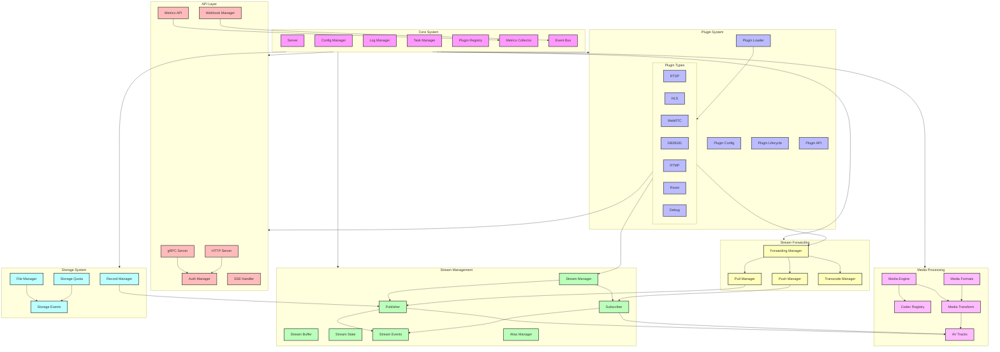

```mermaid
graph TB
    subgraph Core["Core System"]
        Server["Server"]
        ConfigManager["Config Manager"]
        LogManager["Log Manager"]
        TaskManager["Task Manager"]
        PluginRegistry["Plugin Registry"]
        MetricsCollector["Metrics Collector"]
        EventBus["Event Bus"]
    end

    subgraph Media["Media Processing"]
        CodecRegistry["Codec Registry"]
        MediaEngine["Media Engine"]
        AVTracks["AV Tracks"]
        MediaFormats["Media Formats"]
        MediaTransform["Media Transform"]
    end

    subgraph Streams["Stream Management"]
        StreamManager["Stream Manager"]
        Publisher["Publisher"]
        Subscriber["Subscriber"]
        StreamBuffer["Stream Buffer"]
        StreamState["Stream State"]
        StreamEvents["Stream Events"]
        AliasManager["Alias Manager"]
    end

    subgraph Plugins["Plugin System"]
        PluginLoader["Plugin Loader"]
        PluginConfig["Plugin Config"]
        PluginLifecycle["Plugin Lifecycle"]
        PluginAPI["Plugin API"]
        
        subgraph PluginTypes["Plugin Types"]
            RTSP["RTSP"]
            HLS["HLS"]
            WebRTC["WebRTC"]
            GB28181["GB28181"]
            RTMP["RTMP"]
            Room["Room"]
            Debug["Debug"]
        end
    end

    subgraph Storage["Storage System"]
        RecordManager["Record Manager"]
        FileManager["File Manager"]
        StorageQuota["Storage Quota"]
        StorageEvents["Storage Events"]
    end

    subgraph API["API Layer"]
        GRPCServer["gRPC Server"]
        HTTPServer["HTTP Server"]
        WebhookManager["Webhook Manager"]
        AuthManager["Auth Manager"]
        SSEHandler["SSE Handler"]
        MetricsAPI["Metrics API"]
    end

    subgraph Forwarding["Stream Forwarding"]
        ForwardingManager["Forwarding Manager"]
        PullManager["Pull Manager"]
        PushManager["Push Manager"]
        TranscodeManager["Transcode Manager"]
    end

    %% Core System Relationships
    Core --> Plugins
    Core --> API
    Core --> Streams
    Core --> Storage
    Core --> Media
    Core --> Forwarding

    %% Plugin System Relationships
    PluginLoader --> PluginTypes
    PluginTypes --> StreamManager
    PluginTypes --> ForwardingManager
    PluginTypes --> API

    %% Stream Management Relationships
    StreamManager --> Publisher
    StreamManager --> Subscriber
    Publisher --> AVTracks
    Subscriber --> AVTracks
    Publisher --> StreamEvents
    Subscriber --> StreamEvents

    %% Media Processing Relationships
    MediaEngine --> CodecRegistry
    MediaEngine --> MediaTransform
    MediaTransform --> AVTracks
    MediaFormats --> MediaTransform

    %% API Layer Relationships
    GRPCServer --> AuthManager
    HTTPServer --> AuthManager
    WebhookManager --> EventBus
    MetricsAPI --> MetricsCollector

    %% Forwarding Relationships
    ForwardingManager --> PullManager
    ForwardingManager --> PushManager
    ForwardingManager --> TranscodeManager
    PullManager --> Publisher
    PushManager --> Subscriber

    %% Storage Relationships
    RecordManager --> Publisher
    FileManager --> StorageEvents
    StorageQuota --> StorageEvents

    classDef core fill:#f9f,stroke:#333,stroke-width:2px
    classDef plugin fill:#bbf,stroke:#333,stroke-width:2px
    classDef stream fill:#bfb,stroke:#333,stroke-width:2px
    classDef api fill:#fbb,stroke:#333,stroke-width:2px
    classDef media fill:#fbf,stroke:#333,stroke-width:2px
    classDef storage fill:#bff,stroke:#333,stroke-width:2px
    classDef forward fill:#ffb,stroke:#333,stroke-width:2px

    class Server,ConfigManager,LogManager,TaskManager,PluginRegistry,MetricsCollector,EventBus core
    class PluginLoader,PluginConfig,PluginLifecycle,PluginAPI,RTSP,HLS,WebRTC,GB28181,RTMP,Room,Debug plugin
    class StreamManager,Publisher,Subscriber,StreamBuffer,StreamState,StreamEvents,AliasManager stream
    class GRPCServer,HTTPServer,WebhookManager,AuthManager,SSEHandler,MetricsAPI api
    class CodecRegistry,MediaEngine,AVTracks,MediaFormats,MediaTransform media
    class RecordManager,FileManager,StorageQuota,StorageEvents storage
    class ForwardingManager,PullManager,PushManager,TranscodeManager forward
```
