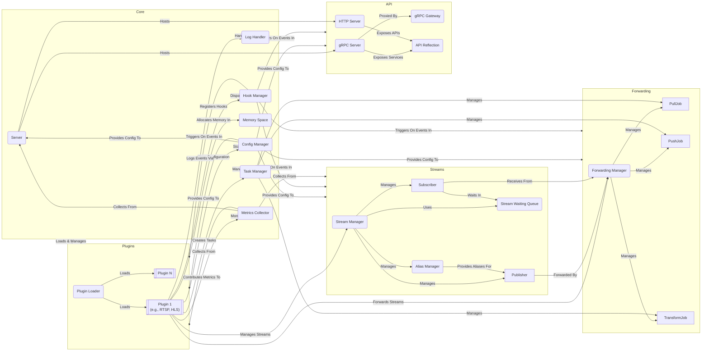

```mermaid
graph LR
    subgraph Core
        direction LR
        Server(Server)
        ConfigManager(Config Manager)
        LogHandler(Log Handler)
        TaskManager(Task Manager)
        HookManager(Hook Manager)
        MemorySpace(Memory Space)
        MetricsCollector(Metrics Collector)
    end

    subgraph Plugins
        direction TB
        PluginLoader(Plugin Loader)
        Plugin[["Plugin 1\n(e.g., RTSP, HLS)"]]
        PluginN[["Plugin N"]]
    end

    subgraph Streams
        direction TB
        StreamManager(Stream Manager)
        Publisher
        Subscriber
        AliasManager(Alias Manager)
        StreamWaitingQueue(Stream Waiting Queue)
    end

    subgraph Forwarding
        direction TB
        ForwardingManager(Forwarding Manager)
        PullJob
        PushJob
        TransformJob
    end

    subgraph API
        direction TB
        GRPCServer(gRPC Server)
        GRPCGateway(gRPC Gateway)
        HTTPServer(HTTP Server)
        APIReflection(API Reflection)
    end

    Core -- "Loads & Manages" --> Plugins
    Core -- "Manages" --> TaskManager
    Core -- "Handles" --> LogHandler
    Core -- "Stores" --> ConfigManager
    Core -- "Dispatches" --> HookManager
    Core -- "Monitors" --> MetricsCollector

    PluginLoader -- "Loads" --> Plugin
    PluginLoader -- "Loads" --> PluginN
    Plugin -- "Registers Hooks" --> HookManager
    Plugin -- "Uses Configuration" --> ConfigManager
    Plugin -- "Creates Tasks" --> TaskManager
    Plugin -- "Manages Streams" --> StreamManager
    Plugin -- "Forwards Streams" --> ForwardingManager
    Plugin -- "Allocates Memory In" --> MemorySpace
    Plugin -- "Logs Events Via" --> LogHandler
    Plugin -- "Contributes Metrics To" --> MetricsCollector

    StreamManager -- "Manages" --> Publisher
    StreamManager -- "Manages" --> Subscriber
    StreamManager -- "Manages" --> AliasManager
    StreamManager -- "Uses" --> StreamWaitingQueue

    AliasManager -- "Provides Aliases For" --> Publisher

    Subscriber -- "Waits In" --> StreamWaitingQueue

    ForwardingManager -- "Manages" --> PullJob
    ForwardingManager -- "Manages" --> PushJob
    ForwardingManager -- "Manages" --> TransformJob

    Publisher -- "Forwarded By" --> ForwardingManager
    Subscriber -- "Receives From" --> ForwardingManager

    Server -- "Hosts" --> GRPCServer
    Server -- "Hosts" --> HTTPServer
    GRPCServer -- "Exposes Services" --> APIReflection
    HTTPServer -- "Exposes APIs" --> APIReflection
    GRPCServer -- "Proxied By" --> GRPCGateway

    ConfigManager -- "Provides Config To" --> Server
    ConfigManager -- "Provides Config To" --> Plugins
    ConfigManager -- "Provides Config To" --> Streams
    ConfigManager -- "Provides Config To" --> Forwarding
    ConfigManager -- "Provides Config To" --> API

    TaskManager -- "Manages" --> PullJob
    TaskManager -- "Manages" --> PushJob
    TaskManager -- "Manages" --> TransformJob

    HookManager -- "Triggers On Events In" --> Streams
    HookManager -- "Triggers On Events In" --> Forwarding
    HookManager -- "Triggers On Events In" --> Plugins
    HookManager -- "Triggers On Events In" --> API

    MetricsCollector -- "Collects From" --> Server
    MetricsCollector -- "Collects From" --> Plugins
    MetricsCollector -- "Collects From" --> Streams
```
