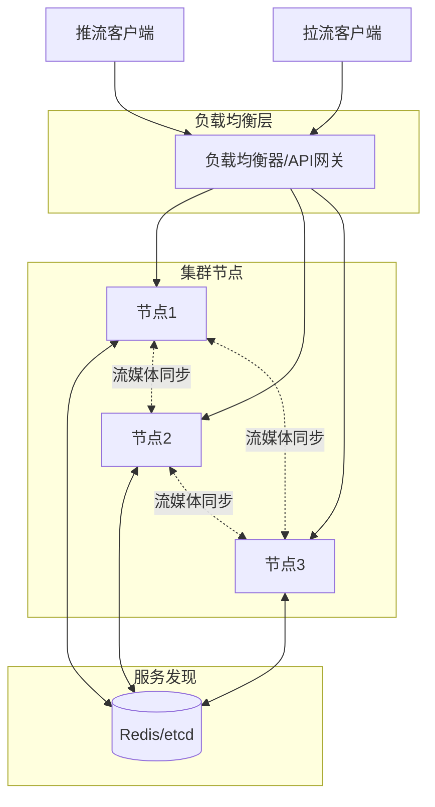
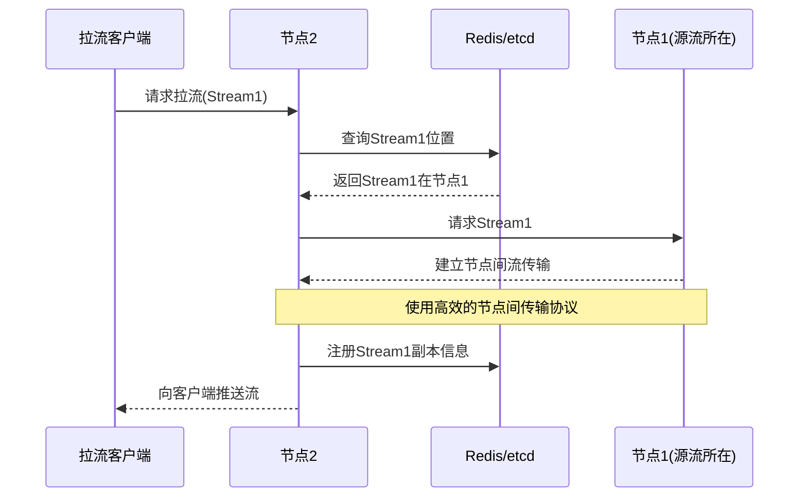
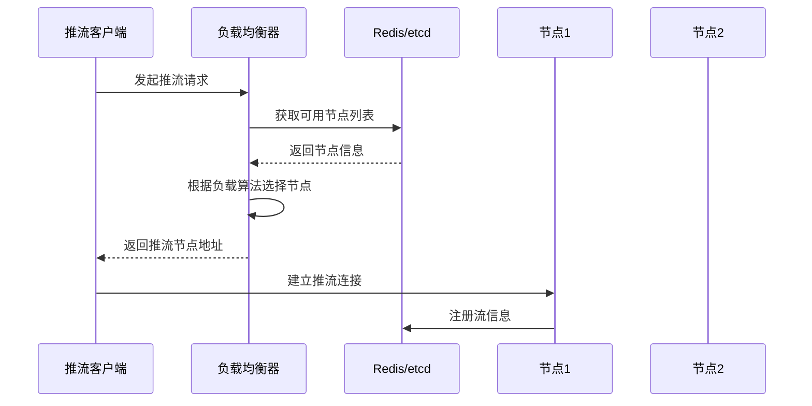
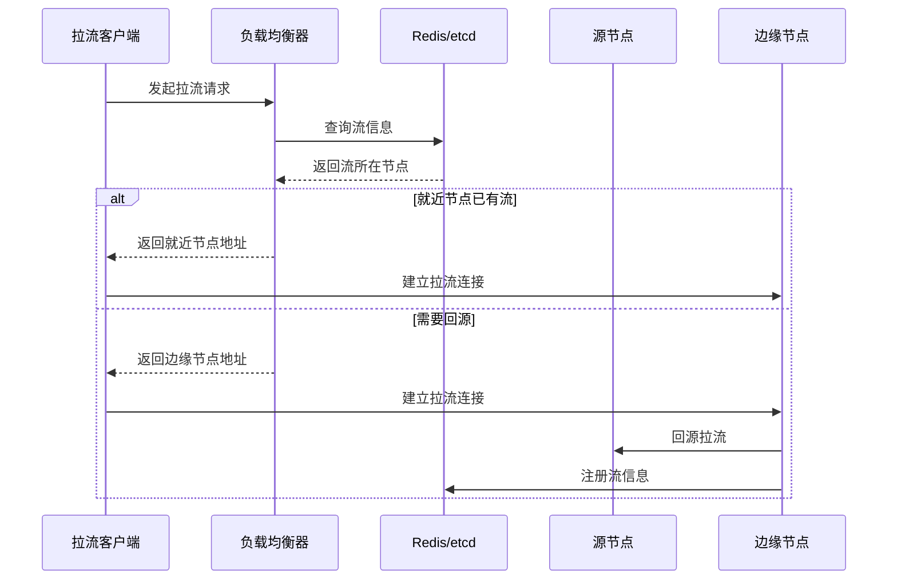

# Monibuca 集群架构设计

本文档描述了 Monibuca 的集群架构设计，包括推流负载均衡和拉流负载均衡的实现方案。

## 整体架构

## 节点间流媒体同步

## 推流负载均衡

## 拉流负载均衡

## 关键特性

1. **高可用性**
   - 节点故障自动切换
   - 无单点故障设计
   - 服务自动发现
   - 多节点流媒体冗余备份

2. **负载均衡策略**
   - 基于节点负载的动态调度
   - 就近接入原则
   - 带宽占用均衡
   - 考虑节点间流量成本

3. **扩展性**
   - 支持水平扩展
   - 动态添加删除节点
   - 平滑扩容/缩容
   - 节点间按需同步流

4. **监控和管理**
   - 集群状态实时监控
   - 流量统计和分析
   - 节点健康检查
   - 跨节点流媒体质量监控

## 实现考虑

1. **服务发现**
   - 使用 Redis 或 etcd 存储集群节点信息
   - 定期更新节点状态和负载信息
   - 支持节点心跳检测
   - 维护流媒体在各节点的分布信息

2. **负载均衡算法**
   - 考虑 CPU 使用率
   - 考虑内存使用情况
   - 考虑带宽使用情况
   - 考虑地理位置因素
   - 考虑节点间网络质量

3. **容错机制**
   - 节点故障自动摘除
   - 流媒体自动切换
   - 会话保持机制
   - 节点间流媒体备份策略

4. **节点间通信**
   - 高效的流媒体转发协议
   - 节点间带宽优化
   - 流媒体缓存策略
   - 按需拉流和预加载策略
   - QoS保证机制 